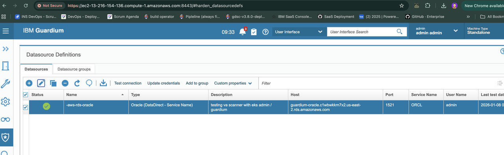
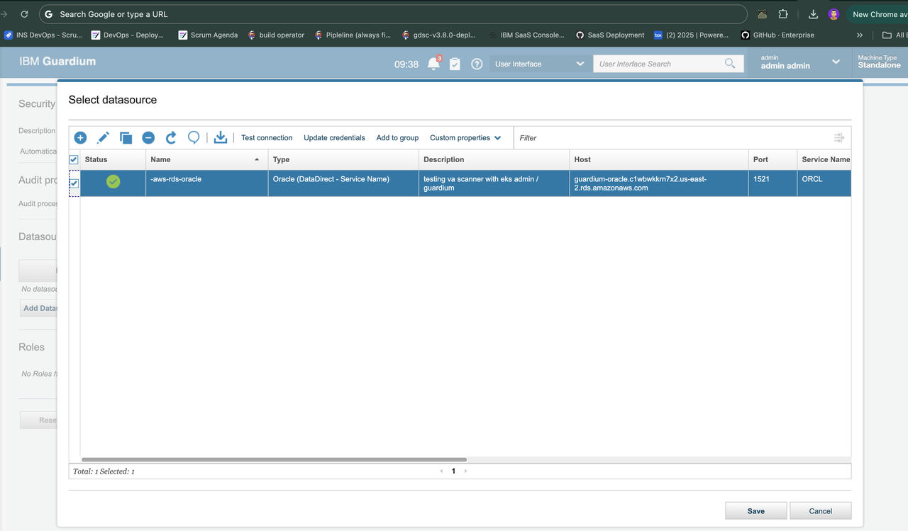
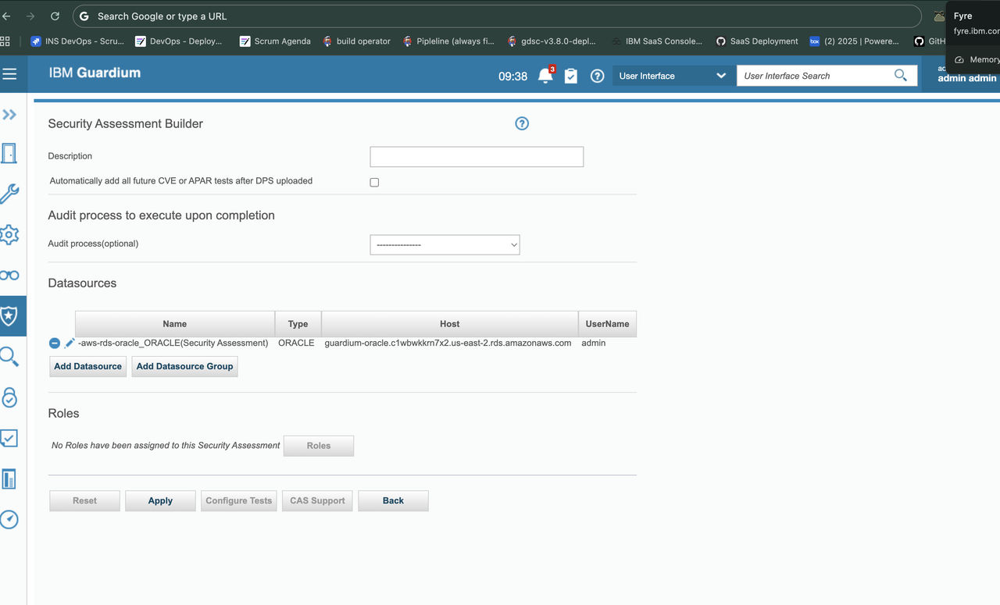
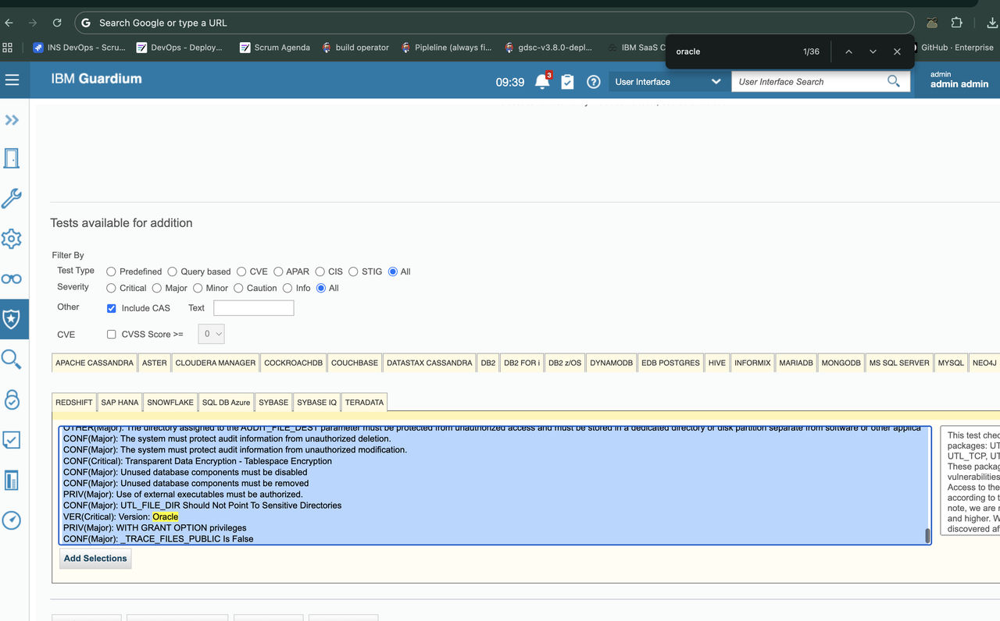

# Guardium VA Scanner Helm Chart

Production-ready Helm chart for deploying Guardium Vulnerability Assessment Scanner on Kubernetes and OpenShift.

## Table of Contents

- [Overview](#overview)
- [Architecture](#architecture)
- [Prerequisites](#prerequisites)
- [Complete Setup Guide](#complete-setup-guide)
  - [Step 1: Deploy GDP Server](#step-1-deploy-gdp-server-)
  - [Step 2: Create Database](#step-2-create-database-on-cloud-or-on-prem-environment-)
  - [Step 3: Configure Data Source in GDP](#step-3-configure-data-source-in-gdp-)
  - [Step 4: Create Security Assessment in GDP](#step-4-create-security-assessment-in-gdp-)
  - [Step 5: Deploy VA Scanner with Helm](#step-5-deploy-va-scanner-with-helm-)
- [Platform-Specific Deployment](#platform-specific-deployment)
  - [Kubernetes (Vanilla, EKS, GKE, AKS)](#kubernetes-vanilla-eks-gke-aks)
  - [OpenShift](#openshift)
- [Common Operations](#common-operations)
- [Advanced Configuration](#advanced-configuration)
- [Troubleshooting](#troubleshooting)
- [Configuration Reference](#configuration-reference)
- [Support and Documentation](#support-and-documentation)

## Overview

This Helm chart deploys the Guardium Vulnerability Assessment (VA) Scanner on Kubernetes and OpenShift platforms. The scanner connects to your Guardium Data Protection (GDP) server to perform automated security assessments on your databases.

**Supported Platforms:**
- Vanilla Kubernetes  ( EKS , Azure , and IBM Clooud)
- Red Hat OpenShift

## Architecture

### High-Level Architecture

```
┌─────────────────────────────────────────────────────────────────────────┐
│                     Cloud or On-Premises Environment                    │
│                                                                         │
│  ┌────────────────────┐          ┌─────────────────────────────────┐    │
│  │   Database         │          │   Kubernetes / OpenShift        │    │
│  │  ┌──────────────┐  │          │  ┌───────────────────────────┐  │    │
│  │  │   Oracle DB  │  │          │  │      va-scanner           │  │    │
│  │  │   MySQL DB   │◄─┼──────────┼──┤   (Helm Deployment)       │  │    │
│  │  │ PostgreSQL   │  │  Assess  │  │                           │  │    │
│  │  │     etc.     │  │          │  │  • Pods (2-10 replicas)   │  │    │
│  │  └──────────────┘  │          │  │  • Auto-scaling (HPA)     │  │    │
│  └────────────────────┘          │  │  • Secrets Management     │  │    │
│           │                      │  └───────────────────────────┘  │    │
│           │                      │              │                  │    │
│           │ Results              └──────────────┼──────────────────┘    │
│           │                                     │                       │
│           │                                     │ HTTPS:8443            │
│           ▼                                     ▼                       │
│           │                       ┌─────────────────────────────────┐   │
│           │                       │    GDP Server (VM/Container)    │   │
│           │                       │  ┌───────────────────────────┐  │   │
│           └──────────────────────►│  │  Guardium Data Protection │  │   │
│                                   │  │                           │  │   │
│                                   │  │  • Assessment Builder     │  │   │
│                                   │  │  • Data Sources Config    │  │   │
│                                   │  │  • Security Tests         │  │   │
│                                   │  │  • API Key Management     │  │   │
│                                   │  │  • Results & Reports      │  │   │
│                                   │  └───────────────────────────┘  │   │
│                                   └─────────────────────────────────┘   │
│                                                                         │
└─────────────────────────────────────────────────────────────────────────┘

                    ┌──────────────────────────────┐
                    │   Your Local Machine         │
                    │                              │
                    │  • kubectl / oc access       │
                    │  • Helm CLI                  │
                    │  • values.yaml config        │
                    └──────────────────────────────┘
```


### Component Roles

| Component | Purpose | Setup Phase |
|-----------|---------|-------------|
| **GDP Server** | Central management server for security assessments | Step 1 |
| **Database** | Target database to be assessed for vulnerabilities | Step 2 |
| **GDP Data Source** | Configuration linking GDP to your database | Step 3 |
| **GDP Assessment** | Security test definitions and schedules | Step 4 |
| **VA Scanner (Helm)** | Automated scanner pods that execute assessments | Step 5 |
| **Kubernetes / OpenShift Cluster** | Container platform hosting the VA Scanner | Prerequisites |

### How It Works

1. **GDP Server** manages assessment configurations and stores results
2. **Database** is registered as a data source in GDP
3. **VA Scanner pods** (deployed via Helm) connect to GDP and receive assessment tasks
4. **Scanners execute tests** against the database through GDP
5. **Results** are sent back to GDP for analysis and reporting
6. **Helm** automates the deployment, scaling, and management of scanner pods


---

## Prerequisites

### Common Requirements (All Platforms)

- ✅ GDP server deployed and accessible (port 8443 open)
- ✅ Database instance created (cloud or on-premises)
- ✅ Helm 3.0+
- ✅ IBM Entitlement Key (for scanner image from cp.icr.io)
- ✅ Sufficient cluster permissions (deployments, secrets, service accounts, namespaces/projects)

### Platform-Specific Requirements

#### Kubernetes (Vanilla, EKS)
- ✅ Kubernetes 1.19+
- ✅ `kubectl` configured with cluster access
- ✅ Permissions to create namespaces, deployments, secrets, service accounts, HPA

#### OpenShift
- ✅ OpenShift 4.x
- ✅ `oc` CLI configured with cluster access
- ✅ Permissions to create projects and resources
- ✅ Understanding of Security Context Constraints (SCC)

---

## Complete Setup Guide

Follow these steps in order to successfully deploy and configure the VA Scanner.

---

### Step 1: Deploy GDP Server 🖥️

**Critical requirements:**
- The GDP Central Manager must be reachable from the cluster where the scanner runs
- Port `8443` must be open from your cluster to the GDP Central Manager
- You must have CLI access to generate the API key used by the scanner
- The user must be able to run `grdapi` successfully on the GDP system

**Recommended approach:**
- Deploy GDP in any environment where your scanner cluster can reach it over `https://<gdp-host>:8443`
- Ensure the hostname used in `gdp.host` matches the server certificate
- Ensure the GDP CLI user can log in over SSH and run:
  ```bash
  ssh user@your-gdp-server
  grdapi create_api_key name=vascanner
  ```

**Warning:** The SSH user must be a GDP CLI user with access to `grdapi`. If that user cannot run `grdapi`, they cannot generate the API key required by this chart.

---

### Step 2: Create Database on Cloud or On-Prem Environment 🗄️

Create a database instance that will be assessed for vulnerabilities.

**Required Information:**
- 📍 **Database endpoint**
- 🔌 **Port**
- 🏷️ **Database name / service name**
- 👤 **Username**
- 🔑 **Password**

**Supported Database Types:**
- ✅ Oracle Database
- ✅ MySQL / MariaDB
- ✅ PostgreSQL
- ✅ Microsoft SQL Server
- ✅ IBM DB2
- ✅ MongoDB
- ✅ Other Guardium-supported databases

**Network Configuration:**
- Ensure the required network path exists for the GDP / scanner deployment model you are using
- Ensure firewalls, security groups, routes, and policies allow the required traffic

---

### Step 3: Configure Data Source in GDP 🔗

Connect your database to the GDP system so it can be assessed for vulnerabilities.

#### 3.1 Access GDP Console

Open your browser and navigate to:
```
https://your-gdp-server:8443
```
Login with your GDP administrator credentials.

#### 3.2 Add Data Source

Follow these steps in the GDP console:

1. **Navigate** to **Data Sources** section
2. **Click** the **➕ Add Data Source** button
3. **Select** your database type:
   - Oracle Database
   - MySQL
   - PostgreSQL
   - SQL Server
   - DB2
   - MongoDB
   - etc.

4. **Enter connection details:**

| Field | Description | Example |
|-------|-------------|---------|
| **Host** | Database endpoint | `mydb.abc123.us-east-1.rds.amazonaws.com` |
| **Port** | Database port | `1521` (Oracle), `3306` (MySQL), `5432` (PostgreSQL) |
| **Database/Service Name** | Database identifier | `ORCL`, `mydb` |
| **Username** | Database user | `admin` |
| **Password** | Database password | `your-secure-password` |

5. **Click** **Test Connection** to verify connectivity
6. **Click** **Save** to store the data source





**✅ Success Indicator:** You should see "Connection successful" message before saving.

---

### Step 4: Create Security Assessment in GDP 🔍

Configure the vulnerability assessment tests that will run on your database.

#### 4.1 Navigate to Assessment Builder

1. Log into GDP console
2. Navigate to **Assessment Builder** section

#### 4.2 Create New Assessment

1. **Click** the **➕ Plus** button to create a new assessment
2. **Enter** a descriptive name (e.g., "Oracle Production DB Assessment")
3. **Click** **Create**

#### 4.3 Add Data Source to Assessment

1. In the assessment configuration page, **click** **➕ Add Data Source**
2. **Select** the data source you created in Step 3
3. **Click** **Save**




#### 4.4 Configure Security Tests

1. **Click** **Configure Test** button
2. **Navigate** to the **Config** tab
3. **Select** your database type (e.g., Oracle, MySQL, PostgreSQL)
4. **Choose** the security tests you want to run:
   - ✅ Configuration vulnerabilities
   - ✅ User privilege checks
   - ✅ Password policy validation
   - ✅ Patch level verification
   - ✅ Encryption settings
   - ✅ Audit configuration
   - ✅ And many more...
5. **Click** **Save**



#### 4.5 Run Assessment (Test)

Before deploying the scanner, test the assessment manually:

1. **Go back** to the assessment overview
2. **Click** **Run Once Now** button
3. The assessment will execute immediately
4. **View results** in the **Assessment Results** section

** Success Indicator:** You should see test results appearing in the results section, indicating the assessment is properly configured.

---

### Step 5: Deploy VA Scanner with Helm 🚀

**This is the final step!** Deploy the VA Scanner to your Kubernetes or OpenShift cluster to automate continuous vulnerability assessments.

Choose your platform below:
- [Kubernetes (Vanilla, EKS, GKE, AKS)](#kubernetes-vanilla-eks-gke-aks)
- [OpenShift](#openshift)

---

## Platform-Specific Deployment

### Kubernetes (Vanilla, EKS, AKS)

Use this section for any standard Kubernetes distribution, including Amazon EKS Azure AKS, or vanilla Kubernetes.

#### 5.1 Prepare Cluster Access

Ensure you have `kubectl` access to your cluster:

```bash
# Verify cluster access
kubectl cluster-info
kubectl get nodes

# Verify permissions
kubectl auth can-i create deployments -n va-scanner
kubectl auth can-i create secrets -n va-scanner
kubectl auth can-i create serviceaccounts -n va-scanner
kubectl auth can-i create hpa -n va-scanner
```

#### 5.1.1 Optional: Create EKS Cluster

**This subsection is OPTIONAL** - only follow if you need to create a new EKS cluster. Skip if you already have a Kubernetes cluster.

<details>
<summary>Click to expand EKS cluster creation commands</summary>

```bash
# Install eksctl if not already installed
# macOS: brew install eksctl
# Linux: https://github.com/weaveworks/eksctl

# Create EKS cluster
eksctl create cluster \
  --name va-scanner-cluster \
  --region us-east-1 \
  --nodegroup-name standard-workers \
  --node-type t3.medium \
  --nodes 3 \
  --nodes-min 2 \
  --nodes-max 4 \
  --managed

# Configure kubectl
aws eks update-kubeconfig --region us-east-1 --name va-scanner-cluster

# Verify cluster
kubectl get nodes
kubectl config current-context
```

**Note:** This creates a new EKS cluster. Adjust parameters based on your requirements. For GKE or AKS, use their respective CLI tools (`gcloud` or `az`).

</details>

#### 5.2 Gather Required Credentials

**GDP API Key:**
```bash
# Log in to the GDP Central Manager CLI
ssh user@your-gdp-server

# Verify this user can access grdapi
grdapi

# Create API key for the scanner
grdapi create_api_key name=vascanner

# Copy and save the "Encoded API key" from the output
```

**Warning:** The SSH user must be a GDP CLI user with permission to run `grdapi`. If the user cannot access `grdapi`, they cannot generate the API key required by this chart.

**GDP Certificate:**

Extract the certificate directly from your GDP server using OpenSSL:

```bash
# Run this command on YOUR LAPTOP (replace YOUR_GDP_HOST with your GDP server):
openssl s_client -connect YOUR_GDP_HOST:8443 -showcerts </dev/null 2>/dev/null | openssl x509 -outform PEM | base64 | tr -d '\n'

# Example:
openssl s_client -connect ec2-54-85-148-224.compute-1.amazonaws.com:8443 -showcerts </dev/null 2>/dev/null | openssl x509 -outform PEM | base64 | tr -d '\n'
```

This will output the base64-encoded certificate in a single line. Copy the entire output.

**Check Certificate Hostname:**

Verify what hostname the certificate is issued for:

```bash
# Run this command to see the certificate's Subject Alternative Name (SAN):
openssl s_client -connect YOUR_GDP_HOST:8443 -showcerts </dev/null 2>/dev/null | openssl x509 -noout -text | grep -A2 "Subject Alternative Name"

# Example output:
#     X509v3 Subject Alternative Name:
#         DNS:ec2-54-85-148-224.compute-1.amazonaws.com
```

**Important:** The hostname in the certificate (DNS name) must match the `gdp.host` value in your configuration. If they match, you don't need host aliases.

**IBM Entitlement Key:**

Get your IBM Entitlement Key for pulling the scanner image:

```bash
# Go to: https://myibm.ibm.com/products-services/containerlibrary
# Click "Copy entitlement key" button
# Save the key - you'll need it for registry.password
```

#### 5.3 Prepare Helm Values File

For **Kubernetes** (including EKS, GKE, AKS), use the **EKS example file**:

```bash
# Navigate to the Helm chart directory
cd src/va-scanner

# Copy the Kubernetes/EKS example file
cp my-values-eks-example.yaml my-values.yaml
```

**Use this file:**
- `my-values-eks-example.yaml` (works for all Kubernetes distributions)

**Do not use:**
- `my-values-openshift-example.yaml` (OpenShift only)

#### 5.4 Configure Your Values

Edit `my-values.yaml` with your specific configuration:

```yaml
# Namespace Configuration
namespace:
  create: false  # Set to false if using --create-namespace flag
  name: va-scanner

# GDP Server Configuration
gdp:
  # GDP Server hostname - MUST match the hostname in your SSL certificate
  # STEP 1: Check certificate hostname:
  #   openssl s_client -connect YOUR_GDP_HOST:8443 -showcerts </dev/null 2>/dev/null | openssl x509 -noout -text | grep -A2 "Subject Alternative Name"
  # STEP 2: Use the DNS name from certificate output
  host: "guard.yourcompany.com"                      # TODO: Replace with YOUR certificate DNS name
  apiKey: "your-base64-encoded-api-key"              # TODO: From step 5.2
  agentName: "k8s-va-scanner-01"                     # Unique identifier for this scanner
  certBase64: "your-base64-encoded-certificate"      # TODO: From step 5.2

# IBM Container Registry Credentials (for cp.icr.io)
registry:
  username: "cp"                                      # Use 'cp' for IBM entitled software
  password: "your-ibm-entitlement-key"               # TODO: From https://myibm.ibm.com/products-services/containerlibrary
  email: "cp"                                        # Use 'cp' for entitled software
  server: cp.icr.io                                  # IBM Container Registry

# Scanner Container Image
image:
  repository: cp.icr.io/cp/ibm-guardium-data-security-center/guardium/vascanner-12.2.0/va-scanner
  tag: "vascanner-v12.2.0"
  pullPolicy: IfNotPresent

# Platform Configuration
platform:
  type: kubernetes  # Use 'kubernetes' for all K8s distributions (vanilla, EKS, GKE, AKS)

# Deployment Configuration
replicaCount: 3  # Number of scanner pods (if HPA is disabled)

# VA Scanner Polling (prevents CrashLoopBackOff when no jobs available)
vaScannerPollInMins: 10  # Poll every 10 minutes

# Optional: Enable auto-scaling
autoscaling:
  enabled: true
  minReplicas: 2
  maxReplicas: 10

# Host Aliases - ONLY needed if certificate hostname differs from actual hostname
# Check if needed by comparing certificate DNS name with gdp.host above
# If they MATCH → use empty array: hostAliases: []
# If they DIFFER → configure mapping:
# hostAliases:
#   - ip: "52.21.60.157"              # TODO: Your GDP server's actual IP
#     hostnames:
#       - "guard.yourcompany.com"     # TODO: Must match gdp.host above
hostAliases: []  # Default: empty (assumes certificate hostname matches)

# Standard Kubernetes security settings
podSecurityContext:
  fsGroup: 10001

# OpenShift settings are not used in Kubernetes
openshift:
  enabled: false
```

#### 5.5 Deploy with Helm

Choose one chart source:

**Option 1: Direct GitHub release URL**
```bash
helm install va-scanner \
  https://github.com/IBM/guardium-helm/releases/download/v1.0.0/va-scanner-1.0.0.tgz \
  -f my-values.yaml \
  -n va-scanner \
  --create-namespace

kubectl get pods -n va-scanner -w
```

**Option 2: Downloaded chart package**
```bash
curl -LO https://github.com/IBM/guardium-helm/releases/download/v1.0.0/va-scanner-1.0.0.tgz
helm install va-scanner ./va-scanner-1.0.0.tgz -f my-values.yaml -n va-scanner --create-namespace

kubectl get pods -n va-scanner -w
```

**Option 3: Cloned repository**
```bash
cd guardium-helm
helm install va-scanner ./src/va-scanner -f my-values.yaml -n va-scanner --create-namespace

kubectl get pods -n va-scanner -w
```

**Update later:**
```bash
helm upgrade va-scanner ./src/va-scanner -f my-values.yaml -n va-scanner
```

**Expected Output:**
```
NAME                          READY   STATUS    RESTARTS   AGE
va-scanner-5d8f7b9c4d-abc12   1/1     Running   0          30s
va-scanner-5d8f7b9c4d-def34   1/1     Running   0          30s
va-scanner-5d8f7b9c4d-ghi56   1/1     Running   0          30s
```

#### 5.6 Verify Successful Deployment

**Check all resources:**
```bash
kubectl get all -n va-scanner
```

**Check scanner logs:**
```bash
kubectl logs -n va-scanner -l app=va-scanner --tail=100 -f
```

**✅ Expected Log Output (Success Indicators):**
```
Using this certificate file for keystore: [ /var/vascanner/certs/vascanner.pem ]
2025-12-18 18:39:09 INFO  VAScannerLogger:147 - VA Scanner App is starting to run
2025-12-18 18:39:09 INFO  VAScannerLogger:147 - VA Scanner App running
2025-12-18 18:39:09 INFO  VAScannerLogger:147 - VA Scanner App connecting to Guardium server
2025-12-18 18:39:14 INFO  VAScannerLogger:147 - Test ID Assessment : ID : 20000 TestID : 4211 Severity : INFO completed
```

**Sample Assessment Execution Logs:**
```
2025-11-26 18:33:49 INFO  VAScannerLogger:147 - Test ID Assessment : ID : 20000 TestID : 20 Severity : INFO completed in 0 minutes and 0 seconds.
2025-11-26 18:33:56 INFO  VAScannerLogger:147 - Test ID Assessment : ID : 20000 TestID : 250 Severity : INFO completed in 0 minutes and 0 seconds.
2025-11-26 18:33:56 INFO  VAScannerLogger:147 - Test ID Assessment : ID : 20000 TestID : 251 Severity : INFO completed in 0 minutes and 0 seconds.
2025-11-26 18:34:07 INFO  VAScannerLogger:147 - Test ID Assessment : ID : 20000 TestID : 220 Severity : INFO completed in 0 minutes and 0 seconds.
```

**Key Success Indicators:**
- ✅ `VA Scanner App is starting to run` - Scanner initialized
- ✅ `VA Scanner App running` - Scanner is active
- ✅ `VA Scanner App connecting to Guardium server` - Connection established
- ✅ `Test ID Assessment : ID : XXXXX TestID : XXX ... completed` - Assessments executing

**🎉 Congratulations!** Your VA Scanner is now deployed and automatically running security assessments on your databases!

---

### OpenShift

Use this section only for **Red Hat OpenShift** deployments.

#### 5.1 Prepare OpenShift Access

Ensure you have `oc` access to your OpenShift cluster:

```bash
# Login to OpenShift
oc login --server=https://api.example.openshift.cluster:6443 --token=<your-token>

# Verify access
oc whoami
oc version

# Verify permissions
oc auth can-i create deployments -n va-scanner
oc auth can-i create secrets -n va-scanner
oc auth can-i create serviceaccounts -n va-scanner
```

#### 5.2 Gather Required Credentials

Follow the same credential gathering steps as Kubernetes section (5.2):
- GDP API Key
- GDP Certificate
- IBM Entitlement Key

#### 5.3 Prepare Helm Values File

For **OpenShift**, use the **OpenShift example file**:

```bash
cd src/va-scanner
cp my-values-openshift-example.yaml my-values.yaml
```

**Use this file:**
- `my-values-openshift-example.yaml`

**Do not use:**
- `my-values-eks-example.yaml`

#### 5.4 Configure OpenShift-Specific Settings

Edit `my-values.yaml` and ensure these OpenShift-specific settings are present:

```yaml
# Platform Configuration
platform:
  type: openshift  # Must be 'openshift' for OCP

# OpenShift Security Context Constraints
openshift:
  enabled: true
  securityContext:
    allowPrivilegeEscalation: false
    capabilities:
      drop:
        - ALL
    seccompProfile:
      type: RuntimeDefault

# Empty podSecurityContext for OpenShift (SCC handles this)
podSecurityContext: {}
```

#### 5.5 Deploy with Helm

**Create project first:**
```bash
oc new-project va-scanner
```

Choose one chart source:

**Option 1: Direct GitHub release URL**
```bash
helm install va-scanner \
  https://github.com/IBM/guardium-helm/releases/download/v1.0.0/va-scanner-1.0.0.tgz \
  -f my-values.yaml \
  -n va-scanner

oc get pods -n va-scanner -w
```

**Option 2: Downloaded chart package**
```bash
curl -LO https://github.com/IBM/guardium-helm/releases/download/v1.0.0/va-scanner-1.0.0.tgz
helm install va-scanner ./va-scanner-1.0.0.tgz -f my-values.yaml -n va-scanner

oc get pods -n va-scanner -w
```

**Option 3: Cloned repository**
```bash
cd guardium-helm
helm install va-scanner ./src/va-scanner -f my-values.yaml -n va-scanner

oc get pods -n va-scanner -w
```

**Update later:**
```bash
helm upgrade va-scanner ./src/va-scanner -f my-values.yaml -n va-scanner
```

#### 5.6 OpenShift Security Notes

- OpenShift uses Security Context Constraints (SCC), so Kubernetes-style fixed UID/GID settings are removed
- Use `my-values-openshift-example.yaml` as the starting point for OCP
- Do not copy the EKS/Kubernetes example into OpenShift
- If your cluster still blocks the pod with SCC-related errors, review the service account permissions and cluster security policy

#### 5.7 Verify Successful Deployment

Use the same verification steps as Kubernetes (section 5.6), but use `oc` instead of `kubectl`:

```bash
# Check all resources
oc get all -n va-scanner

# Check scanner logs
oc logs -n va-scanner -l app=va-scanner --tail=100 -f
```

---

## Common Operations

### Upgrade Deployment

```bash
# Update your values file, then upgrade
helm upgrade va-scanner ./src/va-scanner -f my-values.yaml -n va-scanner

# Watch the rollout
kubectl rollout status deployment/va-scanner -n va-scanner
```

### Rollback Deployment

```bash
# List revisions
helm history va-scanner -n va-scanner

# Rollback to previous version
helm rollback va-scanner -n va-scanner

# Rollback to specific revision
helm rollback va-scanner 2 -n va-scanner
```

### Scale Deployment

```bash
# Disable HPA first if enabled
helm upgrade va-scanner ./src/va-scanner -f my-values.yaml -n va-scanner --set autoscaling.enabled=false

# Scale deployment manually
kubectl scale deployment va-scanner -n va-scanner --replicas=5
```

### Uninstall

```bash
# Remove the deployment
helm uninstall va-scanner -n va-scanner

# Optionally delete the namespace
kubectl delete namespace va-scanner
# Or for OpenShift:
oc delete project va-scanner
```

---

## Advanced Configuration

### Autoscaling (HPA)

```yaml
autoscaling:
  enabled: true
  minReplicas: 2
  maxReplicas: 10
  targetCPUUtilizationPercentage: 70
  targetMemoryUtilizationPercentage: 80
```

### Resource Limits

```yaml
resources:
  limits:
    cpu: 1000m
    memory: 2Gi
  requests:
    cpu: 250m
    memory: 512Mi
```

### Node Affinity

```yaml
affinity:
  nodeAffinity:
    requiredDuringSchedulingIgnoredDuringExecution:
      nodeSelectorTerms:
      - matchExpressions:
        - key: workload-type
          operator: In
          values:
          - scanner
```

---

## Troubleshooting

### Issue: Certificate Hostname Mismatch Error

**Symptoms:**
```
SSL certificate verification failed
Certificate hostname doesn't match
Connection refused or SSL handshake failed
```

**Root Cause:**
Your GDP server certificate is issued for a specific hostname (e.g., `guard.yourcompany.com`), but the actual server is accessed via a different hostname or IP (e.g., `ec2-52-21-60-157.compute-1.amazonaws.com`).

**Solution:**

1. **Use the certificate hostname in your configuration:**
   ```yaml
   gdp:
     host: "guard.yourcompany.com"  # Use certificate hostname, NOT EC2 hostname
   ```

2. **Add hostAliases to map the hostname to the actual IP:**
   ```yaml
   hostAliases:
     - ip: "52.21.60.157"  # Your GDP server's actual IP
       hostnames:
         - "guard.yourcompany.com"  # Certificate hostname
   ```

3. **Extract the correct certificate:**
   ```bash
   # Use the server.pem file that matches your certificate hostname
   base64 < server.pem | tr -d '\n' | pbcopy  # macOS
   base64 -w 0 < server.pem                    # Linux
   ```

4. **Verify your certificate fingerprint:**
   ```bash
   openssl x509 -in server.pem -noout -fingerprint -sha256
   # Should match: C4:40:9D:9A:... (your expected fingerprint)
   ```

**Complete Example:**
```yaml
gdp:
  host: "guard.yourcompany.com"
  certBase64: "LS0tLS1CRUdJTi..."  # From server.pem

hostAliases:
  - ip: "52.21.60.157"
    hostnames:
      - "guard.yourcompany.com"
```

---

### Issue: PKIX Certificate Path Building Failed (Enterprise CA Certificates)

**Symptoms:**
```
PKIX path building failed: sun.security.provider.certpath.SunCertPathBuilderException:
unable to find valid certification path to requested target
VA Scanner App could not connect to Guardium server
```

**Root Cause:**
Your GDP server uses an **enterprise CA certificate** (such as IBM Internal CA, corporate CA, or self-signed certificate) that is not in the Java default truststore. The VA Scanner's Java application cannot validate the certificate chain.

**Common Examples:**
- IBM Internal CA certificates
- Corporate/Enterprise CA certificates
- Self-signed certificates
- Private CA certificates

**How to Identify:**
Check your certificate issuer:
```bash
openssl s_client -connect YOUR_GDP_HOST:8443 -showcerts </dev/null 2>/dev/null | openssl x509 -noout -issuer

# Examples of enterprise CAs:
# issuer=C=US, O=International Business Machines Corporation, CN=IBM INTERNAL INTERMEDIATE CA
# issuer=C=US, O=YourCompany, CN=YourCompany Root CA
# issuer=CN=Self-Signed Certificate
```

---

### **Solution: Automatic (Chart v1.1.1+)**

**✅ Upgrade to chart version 1.1.1 or later** to get automatic enterprise CA certificate support.

**If you're using an older chart version:**
```bash
# Upgrade to the latest chart version
helm repo update
helm upgrade va-scanner guardium-helm/va-scanner --version 1.1.1 \
  --namespace va-scanner \
  -f my-values.yaml
```

**What the chart does automatically:**
1. ✅ Mounts your PEM certificate at `/var/vascanner/certs/vascanner.pem`
2. ✅ Sets environment variables to tell the VA Scanner to use PKCS12 keystore
3. ✅ VA Scanner application automatically:
   - Reads the PEM certificate
   - Creates a PKCS12 keystore (`.p12` file) at runtime
   - Imports the full certificate chain (including IBM Internal Root CA)
   - Uses this keystore for SSL/TLS validation

**You do NOT need to:**
- ❌ Manually create a `.p12` file
- ❌ Convert certificates yourself
- ❌ Configure keystore properties
- ❌ Access the pod to make changes

**Verification:**
After deployment, check the logs to confirm automatic keystore creation:
```bash
kubectl logs -n va-scanner -l app.kubernetes.io/name=va-scanner --tail=50 | grep -i keystore

# ✅ Expected successful output:
# Using this certificate file for keystore: [ /var/vascanner/certs/vascanner.pem ]
# DEBUG VAScannerLogger:155 - VAScanner keystore password is created successfully.
# DEBUG VAScannerLogger:155 - VAScanner keystore is created successfully.
# DEBUG VAScannerLogger:155 - VAScanner encrypts keystore password successfully.
# DEBUG VAScannerLogger:155 - VAScanner stores encoded keystore password successfully.
```

Then verify the scanner connects successfully:
```bash
kubectl logs -n va-scanner -l app.kubernetes.io/name=va-scanner --tail=100 | grep -i "connecting\|success"

# ✅ Expected output:
# INFO  VAScannerLogger:147 - VA Scanner App connecting to Guardium server at URI : https://your-gdp-host:8443
# DEBUG VAScannerLogger:155 - VAScanner decrypts keystore password successfully.
# INFO  VAScannerLogger:147 - VA Scanner App status: Success.
```

---

### Issue: Helm Installation Failed - Namespace Already Exists

**Symptoms:**
```
Error: INSTALLATION FAILED: Namespace "va-scanner" exists and cannot be imported
```

**Solution:**
If you created the namespace manually before running Helm, either:

**Option 1: Delete and let Helm create it**
```bash
kubectl delete namespace va-scanner
helm install va-scanner ./src/va-scanner -f my-values.yaml -n va-scanner --create-namespace
```

**Option 2: Skip namespace creation in Helm**
```bash
# Edit your my-values.yaml file
# Set: namespace.create: false
helm install va-scanner ./src/va-scanner -f my-values.yaml -n va-scanner
```

---

### Issue: Pods in CrashLoopBackOff When No Jobs Available

**Symptoms:**
```bash
kubectl get pods -n va-scanner
NAME                          READY   STATUS             RESTARTS   AGE
va-scanner-6bffc45f54-5xsl2   0/1     CrashLoopBackOff   4          3m23s
va-scanner-6bffc45f54-s5h2c   0/1     CrashLoopBackOff   4          3m39s
```

**Logs show normal operation:**
```
VA Scanner App got empty JobQueue. Nothing to do.
VA Scanner App status: Success.
VA Scanner App shutting down at 2025-11-26 18:07:18
```

**Root Cause:**
The VA scanner exits successfully (code 0) when no jobs are available. Kubernetes restarts the pod, causing CrashLoopBackOff status even though the scanner is working correctly.

**Solution:**
Enable internal polling to keep pods running:

```yaml
# In your values.yaml
vaScannerPollInMins: 10  # Poll every 10 minutes
```

**Result:**
```bash
kubectl get pods -n va-scanner
NAME                          READY   STATUS    RESTARTS   AGE
va-scanner-6bffc45f54-5xsl2   1/1     Running   0          10m
va-scanner-6bffc45f54-s5h2c   1/1     Running   0          10m
```

---

### Issue: Pods Not Starting

**Symptoms:**
- Pods stuck in `Pending` or `ImagePullBackOff` state

**Solutions:**

1. **Check image pull secrets:**
```bash
kubectl get secret ibm-entitlement-key -n va-scanner
kubectl describe pod -n va-scanner -l app=va-scanner
```

2. **Verify registry credentials:**
```bash
# Check if secret exists and has correct data
kubectl get secret ibm-entitlement-key -n va-scanner -o yaml
```

3. **Check events:**
```bash
kubectl get events -n va-scanner --sort-by='.lastTimestamp' | grep -i pull
```

---

### Issue: Scanner Cannot Connect to GDP

**Symptoms:**
- Logs show connection errors
- No assessment results in GDP

**Solutions:**

1. **Verify GDP host is accessible:**
```bash
# Test from a debug pod
kubectl run -it --rm debug --image=busybox --restart=Never -n va-scanner -- sh
nc -zv your-gdp-host 8443
```

2. **Check GDP configuration:**
```bash
# Verify GDP host
kubectl get secret va-scanner-credentials -n va-scanner -o jsonpath='{.data.GDP_HOST_IP}' | base64 -d

# Verify API key exists
kubectl get secret va-scanner-credentials -n va-scanner -o jsonpath='{.data.GDP_API_KEY}' | base64 -d
```

3. **Verify certificate:**
```bash
kubectl get secret va-cert -n va-scanner -o jsonpath='{.data.ca\.crt}' | base64 -d | openssl x509 -text -noout
```

4. **Check network connectivity:**
- Ensure GDP server port 8443 is open
- Verify security groups (AWS) or firewall rules allow traffic
- Confirm GDP is not behind IBM-only network restrictions

---

### Issue: Assessments Not Running

**Symptoms:**
- Scanner connects but no assessments execute
- No test results in GDP console

**Solutions:**

1. **Verify assessment configuration in GDP:**
   - Check that data source is added to assessment
   - Confirm tests are configured
   - Ensure assessment is set to run

2. **Check scanner logs:**
```bash
kubectl logs -n va-scanner -l app=va-scanner --tail=200 -f
```

3. **Verify data source connectivity from GDP:**
   - Test connection in GDP console
   - Check database credentials
   - Ensure database is accessible from GDP server

---

### View Detailed Logs

```bash
# All pods
kubectl logs -n va-scanner -l app=va-scanner --tail=200

# Specific pod
kubectl logs -n va-scanner <pod-name> --tail=200 -f

# Previous container (if crashed)
kubectl logs -n va-scanner <pod-name> --previous
```

### Check Resource Usage

```bash
# Pod resource usage
kubectl top pods -n va-scanner

# HPA status
kubectl describe hpa -n va-scanner

# Node resource usage
kubectl top nodes
```

---

## Configuration Reference

### Required Values

| Parameter | Description | Example |
|-----------|-------------|---------|
| `namespace.name` | Kubernetes namespace | `va-scanner` |
| `gdp.host` | GDP server hostname/IP | `ec2-xx-xxx.compute-1.amazonaws.com` |
| `gdp.apiKey` | GDP API key (base64 encoded) | `your-base64-api-key` |
| `gdp.agentName` | Unique VA agent identifier | `my-va-scanner` |
| `gdp.certBase64` | GDP certificate (base64 encoded) | `LS0tLS1CRUdJTi...` |
| `registry.username` | IBM Entitlement username | `cp` |
| `registry.password` | IBM Entitlement key | `your-entitlement-key` |
| `registry.email` | Registry email | `cp` |

### Optional Values

| Parameter | Description | Default |
|-----------|-------------|---------|
| `vaScannerPollInMins` | **IMPORTANT:** Polling interval in minutes. Prevents CrashLoopBackOff when no jobs available. Set to 0 to disable. | `10` |
| `namespace.create` | Create namespace | `true` |
| `registry.server` | Registry server URL | `cp.icr.io` |
| `image.repository` | Scanner image repository | `cp.icr.io/cp/ibm-guardium-data-security-center/guardium/vascanner-12.2.0/va-scanner` |
| `image.tag` | Scanner image tag | `vascanner-v12.2.0` |
| `image.pullPolicy` | Image pull policy | `IfNotPresent` |
| `replicaCount` | Number of replicas (if HPA disabled) | `3` |
| `autoscaling.enabled` | Enable Horizontal Pod Autoscaler | `true` |
| `autoscaling.minReplicas` | Minimum replicas | `2` |
| `autoscaling.maxReplicas` | Maximum replicas | `10` |
| `autoscaling.targetCPUUtilizationPercentage` | Target CPU for scaling | `70` |
| `autoscaling.targetMemoryUtilizationPercentage` | Target memory for scaling | `80` |
| `resources.requests.cpu` | CPU request | `250m` |
| `resources.requests.memory` | Memory request | `512Mi` |
| `resources.limits.cpu` | CPU limit | `1000m` |
| `resources.limits.memory` | Memory limit | `2Gi` |
| `platform.type` | Platform type (`kubernetes` or `openshift`) | `kubernetes` |
| `openshift.enabled` | Enable OpenShift-specific settings | `false` |

---

## Support and Documentation

### Additional Resources

- [Guardium Data Protection Documentation](https://www.ibm.com/docs/en/guardium)
- [IBM Docs: Deploy and configure Vulnerability Assessment Scanner](https://www.ibm.com/docs/en/gdp/12.x?topic=environments-deploy-configure-vulnerability-assessment-scanner)
- [Kubernetes Documentation](https://kubernetes.io/docs/)
- [Helm Documentation](https://helm.sh/docs/)
- [OpenShift Documentation](https://docs.openshift.com/)

### Getting Help

If you encounter issues:
1. Check the troubleshooting section above
2. Review scanner logs for error messages
3. Verify all prerequisites are met
4. Ensure network connectivity between components
5. Contact your Guardium administrator or IBM support

---

## License

This project is licensed under the Apache License 2.0 - see the LICENSE file for details.
